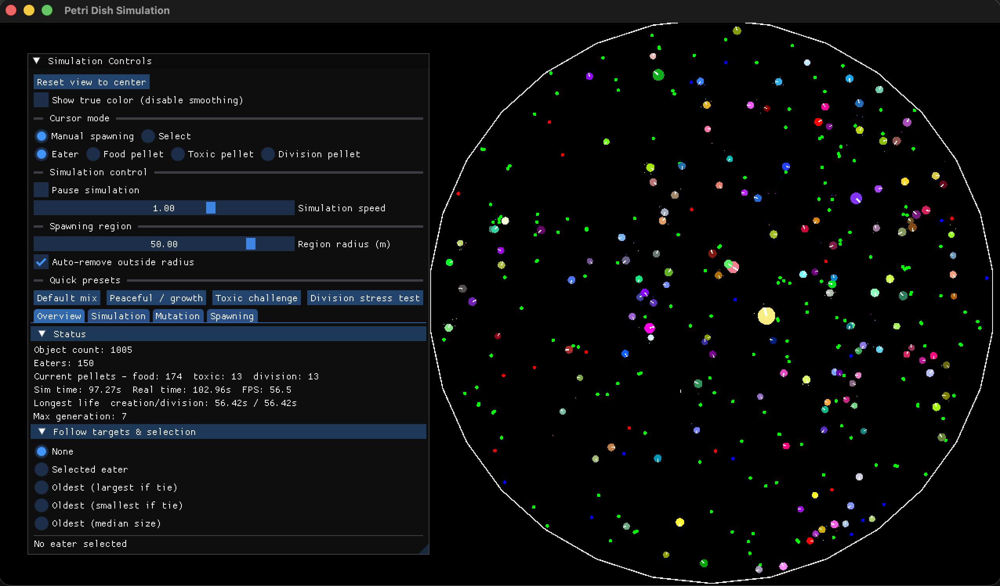

# Petri Dish Simulation
An interactive 2D petri dish where autonomous "creature" cells chase down pellets, grow, split, and mutate. Each creature is driven by a small neural graph (NEAT) and runs on top of SFML rendering, Box2D physics, and an ImGui control panel that lets you spawn entities, tune mutation knobs, and watch the ecosystem adapt in real time.



## What's inside
- SFML 3 for rendering/audio and ImGui overlays for live controls.
- Box2D v3 physics for the dish boundary, collisions, and sensors.
- NEAT-based brains that steer creatures toward food, away from toxins, and into reproduction.
- Multiple pellet types (food, toxic, division) to push different survival pressures.
- Camera controls and selection/follow modes so you can inspect any creature as it evolves.

## Install & run
The project builds everything from source (SFML, ImGui, ImGui-SFML, Box2D, NEAT) via CMake FetchContent.

### Prerequisites
- CMake 3.11+ and a C++20 compiler (Clang/GCC/MSVC).
- Git (for fetching third-party deps during configure).
- Ninja or Make available if you want faster local builds (optional).

### Build (macOS/Linux)
```bash
# From the repo root
cmake -B build -DCMAKE_BUILD_TYPE=Debug
cmake --build build --config Debug --target run
```
The `run` target launches the app after building. For quick iteration you can also use:
```bash
./dev.sh
```
It will configure (if needed), build, and run the simulation in one step.

### Release build and macOS app bundle
```bash
cmake -B build -DCMAKE_BUILD_TYPE=Release
cmake --build build --config Release
cmake --install build --prefix dist
```
Double-click `dist/Petri Dish Simulation.app` to run, or zip that folder to distribute. To generate a DMG instead, run from the build directory after the Release build:
```bash
cpack -G DragNDrop
```
This emits `PetriDishSimulation-<version>.dmg`.

### UML diagrams (clang-uml)
`clang-uml` is configured via `clang-uml.yml`. With `build/compile_commands.json` already generated by CMake, create diagrams into `uml/` with:
```bash
clang-uml --config clang-uml.yml
```
Common diagrams in the config:
- `petri_component_overview`: high-level class relationships (fields/methods hidden).
- `petri_package_overview`: package/folder dependency view.
- `petri_game_details`: detailed classes scoped to `include/game` + `src/game`.
- `petri_circles_details`: detailed classes scoped to `include/circles` + `src/circles`.
- `petri_flow_simple`: simplified flow chart (sequence) starting from `main()`.
- `class_CirclePhysics`: per-class context diagram for the top-level `CirclePhysics`.
- `class_DrawableCircle`: per-class context diagram for `DrawableCircle`.
- `class_EatableCircle`: per-class context diagram for `EatableCircle`.
- `class_CircleRegistry`: per-class context diagram for `CircleRegistry`.
- `class_CreatureCircle`: per-class context diagram for `CreatureCircle`.
- `petri_class_diagram`: full class diagram for the whole project.
- `petri_sequence_diagram`: sequence starting from `main()`.

Generate all common diagrams at once (overview, flow, detailed) and render SVGs if `plantuml` is available:
```bash
./generate_diagrams.sh
```
